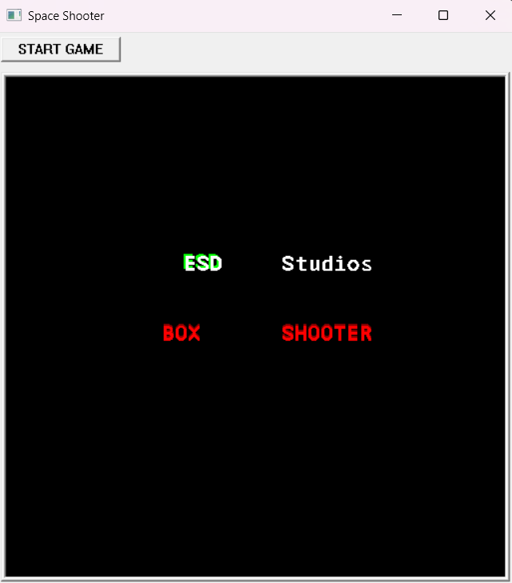
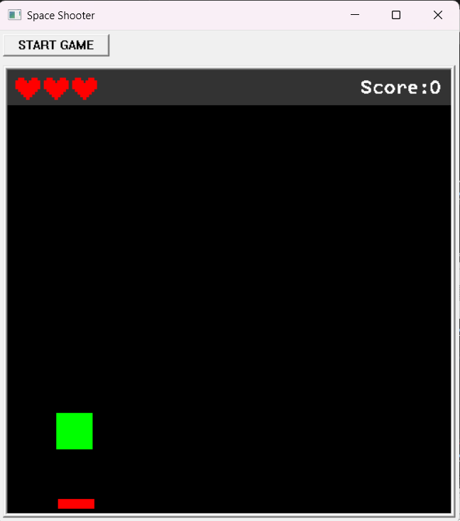
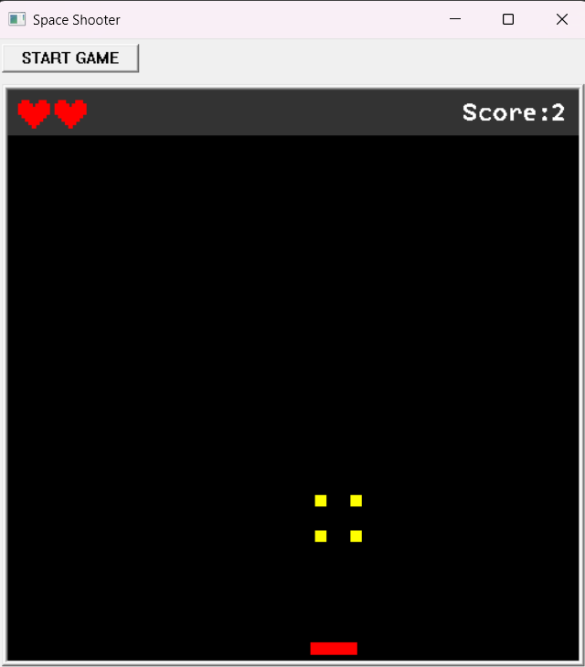
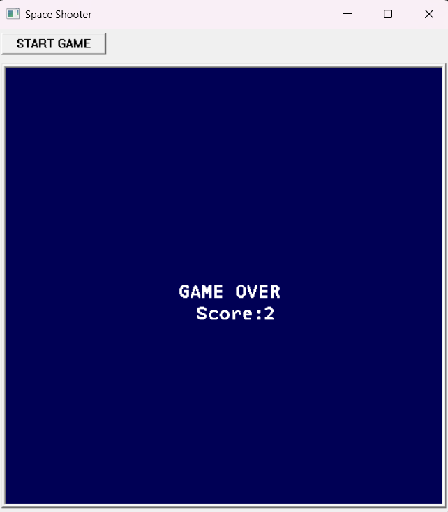

# Box Shooter Game

A simple box shooter game created with multi-threading and animation features. The game includes various elements like score tracking, heart and life management, intro animations, explosion effects, and game-over screens. The project is developed using C++ and is ideal for learning game development concepts, thread management, and user input handling.

## Features

- **Start Screen**: Includes intro animations and the start button.
- **Gameplay**: Shoot and destroy boxes while avoiding collisions.
- **Score Tracking**: Keeps track of your score during gameplay.
- **Game Over Screen**: Displays the final score and allows restarting the game.
- **Explosions & Animations**: Smooth animations for shooting and box destruction.
- **Life Management**: Heart icons represent the player's life, with collisions causing loss of life.
- **Threads**: Multiple threads for smooth animation and game logic management.
- **Sound Effects**: Background music and sound effects for various game events.

## Installation & Setup

1. Clone the repository:
   ```bash
   git clone https://github.com/ErenKaradeniz0/Box_Shooter_Game.git
   cd Box_Shooter_Game
   
2. Install the **ICbytes** library if it's not already installed:
   - Visit [ICbytes official documentation](https://otoidrak.com/doc/I-See-Bytes%20A%20Simplified%20C++%20Library.pdf) for installation instructions.
   - Visit [ICbytes Main Page](https://otoidrak.com/Yazilim.html)

## Images





## Contributors

👤 **Eren Karadeniz** - [GitHub](https://github.com/ErenKaradeniz0)  
👤 **Ulas Deniz Cakmazel** - [GitHub](https://github.com/UlasDenizCakmazel)  
👤 **Sevval Gur** - [GitHub](https://github.com/svvlgr)  

## License

📜 This project is licensed under the MIT License.
